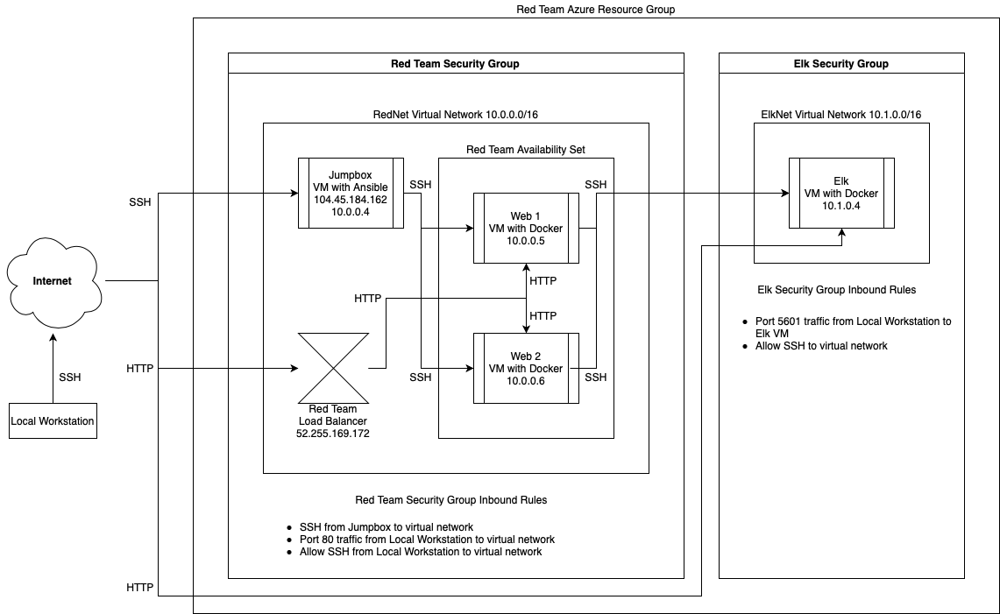

## Automated ELK Stack Deployment

The files in this repository were used to configure the network depicted below.



These files have been tested and used to generate a live ELK deployment on Azure. They can be used to either recreate the entire deployment pictured above. Alternatively, select portions of the playbook file may be used to install only certain pieces of it, such as Filebeat.

```
---
- name: Configure Elk VM with Docker
  hosts: elk
  become: true
  tasks:
    # Use apt module
    - name: Install docker.io
      apt:
        update_cache: yes
        name: docker.io
        state: present

      # Use apt module
    - name: Install pip3
      apt:
        force_apt_get: yes
        name: python3-pip
        state: present

      # Use pip module
    - name: Install Docker python module
      pip:
        name: docker
        state: present

      # Use sysctl module
    - name: Use more memory
      sysctl:
        name: vm.max_map_count
        value: "262144"
        state: present
        reload: yes

      # Use docker_container module
    - name: download and launch a docker elk container
      docker_container:
        name: elk
        image: sebp/elk:761
        state: started
        restart_policy: always
        published_ports:
          - 5601:5601
          - 9200:9200
          - 5044:5044
```

This document contains the following details:
- Description of the Topologu
- Access Policies
- ELK Configuration
  - Beats in Use
  - Machines Being Monitored
- How to Use the Ansible Build


### Description of the Topology

The main purpose of this network is to expose a load-balanced and monitored instance of DVWA, the D*mn Vulnerable Web Application.

Load balancing ensures that the application will be highly reliable, in addition to restricting traffic to the network. Load balancers protect the system from DDoS attacks. This network uses a Jump Box which is only used for administrative tasks, allowing for greater security for the system. All administrative tasks have to go through the Jump Box which allows for more focused security measures.

Integrating an ELK server allows users to easily monitor the vulnerable VMs for changes to the data and system settings. Filebeat is installed onto the server to monitor and record logs and files.

The configuration details of each machine may be found below.

| Name     | Function   | IP Address | Operating System |
|----------|------------|------------|------------------|
| Jump Box | Gateway    | 10.0.0.4   | Linux            |
| Web 1    | Testing    | 10.0.0.5   | Linux            |
| Web 2    | Testing    | 10.0.0.6   | Linux            |
| Elk      | Monitoring | 10.1.0.4   | Linux            |


### Access Policies

The machines on the internal network are not exposed to the public Internet. 

Only the Jump Box machine can accept connections from the Internet. Access to this machine is only allowed from the following IP addresses:
`45.131.192.86`

Machines within the network can only be accessed by each other. The Web VMs send traffic to the Elk Server.

A summary of the access policies in place can be found in the table below.

| Name     | Publicly Accessible | Allowed IP Address |
|----------|---------------------|--------------------|
| Jump Box | Yes                 | 45.131.192.86      |
| Web 1    | No                  | 10.0.0.1-254       |
| Web 2    | No                  | 10.0.0.1-254       |
| Elk      | No                  | 10.0.0.1-254       |

### Elk Configuration

Ansible was used to automate configuration of the ELK machine. No configuration was performed manually, which is advantageous because the process becomes quick and consistent. With the same playbook, the exact same configurations will be setup for any machine that uses it.

The playbook implements the following tasks:
- Install Docker
- Install pip
- Use pip to install the Docker Python Module
- Use sysctl to increase max memory
- Download and launch the Docker Elk Container

The following screenshot displays the result of running `docker ps` after successfully configuring the ELK instance.


### Target Machines & Beats
This ELK server is configured to monitor the following machines:
- _TODO: List the IP addresses of the machines you are monitoring_

We have installed the following Beats on these machines:
- _TODO: Specify which Beats you successfully installed_

These Beats allow us to collect the following information from each machine:
- _TODO: In 1-2 sentences, explain what kind of data each beat collects, and provide 1 example of what you expect to see. E.g., `Winlogbeat` collects Windows logs, which we use to track user logon events, etc._

### Using the Playbook
In order to use the playbook, you will need to have an Ansible control node already configured. Assuming you have such a control node provisioned: 

SSH into the control node and follow the steps below:
- Copy the _____ file to _____.
- Update the _____ file to include...
- Run the playbook, and navigate to ____ to check that the installation worked as expected.

_TODO: Answer the following questions to fill in the blanks:_
- _Which file is the playbook? Where do you copy it?_
- _Which file do you update to make Ansible run the playbook on a specific machine? How do I specify which machine to install the ELK server on versus which to install Filebeat on?_
- _Which URL do you navigate to in order to check that the ELK server is running?

_As a **Bonus**, provide the specific commands the user will need to run to download the playbook, update the files, etc._
